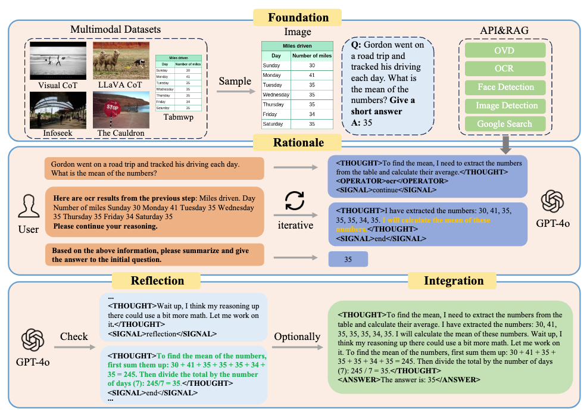

# MMAT-1M

[**🌐 Homepage**](https://MMAT-1M.github.io/) | | [**🤗 MMAT-1M**](https://huggingface.co/datasets/VIS-MPU-Agent/MMAT-1M) | [**📖 MMAT-1M arXiv**](https://arxiv.org/abs/2507.21924)

## Update
- [2025-07-30] The MMAT-1M arXiv paper has been updated.
- [2025-07-17] The MMAT-1M dataset, a million-scale multimodal agent tuning dataset, has been released!🔥 😆
  
## Introduction

### MMAT-1M

MMAT-1M is a new million-scale multimodal agent tuning dataset designed to unlock the full potential of multimodal large language models in Chain-of-Thought (CoT) reasoning, reflection, and dynamic tool utilization. Unlike the current lack of large-scale, high-quality agent tuning resources in the multimodal domain, MMAT-1M is constructed through a novel four-stage data engine: first, curating publicly available multimodal datasets with question-answer pairs; second, leveraging GPT-4o to generate rationales for these pairs and dynamically integrate API calls and Retrieval Augmented Generation (RAG) information via a multi-turn paradigm; third, refining rationales through reflection to ensure logical consistency and accuracy, forming a multi-turn dialogue dataset with both Rationale and Reflection (RR); finally, optionally compressing multi-turn dialogues into a One-turn Rationale and Reflection format (ORR) for efficiency. 




## Dataset Creation

MMAT-1M is meticulously designed to challenge and evaluate multimodal models with complex reasoning. For more detailed information, please refer to our Hugging Face datasets:

- [**🤗 MMAT-1M Dataset**](https://huggingface.co/datasets/VIS-MPU-Agent/MMAT-1M)


## **License & Disclaimer**  
**MMAT-1M** is a composite multimodal dataset derived from multiple sources with heterogeneous licenses. By using this dataset, you agree to comply with the following terms and all applicable source license conditions.

#### **1. Source License Compliance**  
MMAT-1M integrates data under the following licenses:  
| Source Dataset       | License                                                                 | Key Restrictions                          |  
|----------------------|-------------------------------------------------------------------------|------------------------------------------|  
| **Visual CoT**       | [Apache 2.0](https://www.apache.org/licenses/LICENSE-2.0)              | Requires attribution and license notice. |  
| **LLaVA-CoT**        | [Apache 2.0](https://www.apache.org/licenses/LICENSE-2.0)              | Same as above.                           |  
| **The Cauldron**     | Subset-specific licenses + **CC-BY-4.0** for derived prompts           | Commercial use may require separate permissions. |  
| **TabMWP**           | [CC BY-NC-SA 4.0](https://creativecommons.org/licenses/by-nc-sa/4.0/)  | **Non-commercial only**, share-alike.   |  
| **Infoseek**         | [Apache 2.0](https://www.apache.org/licenses/LICENSE-2.0)              | Attribution required.                    |  

#### **2. Reporting Violations**  
If you suspect license non-compliance in MMAT-1M, please contact us.

#### **3. Limitation of Liability**  
The MMAT-1M team:  
- Does not warrant the legal status of individual data samples.  
- Is not liable for misuse of dataset components beyond their original license terms.  


## Citation

**BibTeX:**
```bibtex
@inproceedings{Gao2025MMAT1M,
  title={MMAT-1M: A Large Reasoning Dataset for Multimodal Agent Tuning},
  author={Tianhong Gao and Yannian Fu and Weiqun Wu and Haixiao Yue and Shanshan Liu and Gang Zhang},
  booktitle={Proceedings of ICCV},
  year={2025},
}
